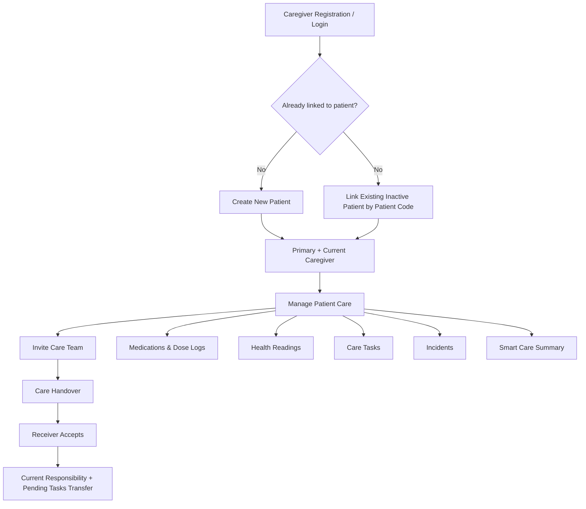
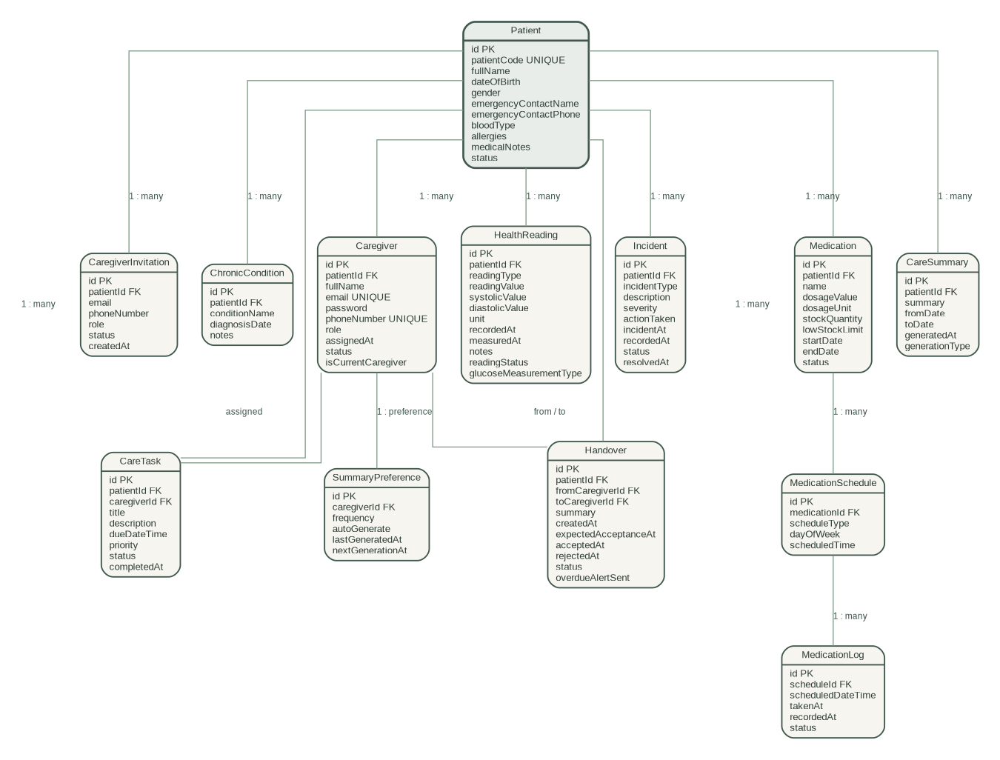
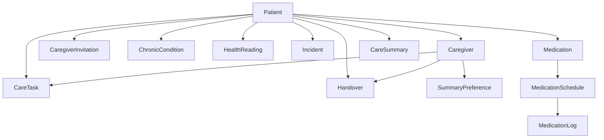

<p align="center">
  
</p>

<h1 align="center">Yusr | يسر 🌿</h1>

<p align="center">
  <b>Easier Care ... A Better Life</b><br>
  <b>رعاية أسهل... لحياة أفضل</b>
</p>

<p align="center">
  A family caregiving management system that brings caregivers, medications,
  health monitoring, daily tasks, incidents, handovers, and smart care summaries
  together in one place.
</p>

---

## About Yusr

**Yusr** is a family caregiving management system designed to make day-to-day patient care easier to coordinate, safer to follow, and clearer for everyone involved.

Instead of keeping medications, health readings, care tasks, incidents, caregiver responsibilities, and updates in separate places, Yusr brings them together in one system.

The system also integrates **AI-generated care summaries, Email, and WhatsApp notifications** to improve communication and continuity between caregivers.

---

## Table of Contents

- [Problem](#problem)
- [Solution](#solution)
- [Main Users](#main-users)
- [Core Features](#core-features)
- [Smart Care Summary](#smart-care-summary-)
- [AI, Email & WhatsApp Integrations](#ai-email--whatsapp-integrations)
- [Care Workflow](#care-workflow)
- [Business Logic](#business-logic)
- [System Architecture](#system-architecture)
- [Database Models](#database-models)
- [UML / Entity Relationships](#uml--entity-relationships)
- [Important API Endpoints](#important-api-endpoints)
- [Frontend Pages](#frontend-pages)
- [Technologies](#technologies)
- [Project Structure](#project-structure)
- [Running the Project](#running-the-project)
- [Why Yusr?](#why-yusr)
- [Author](#author)

---

# Problem

Family caregiving often involves more than one person and many daily responsibilities. Important information can easily become scattered between messages, notes, calls, and different family members.

This creates practical problems such as:

- Unclear responsibility between caregivers.
- Missed or unrecorded medication doses.
- Difficulty following medication stock and schedules.
- Health readings being recorded without a clear history.
- Care tasks being forgotten or assigned to the wrong person.
- Important incidents not reaching the rest of the care team quickly.
- Poor continuity when responsibility moves from one caregiver to another.
- Difficulty understanding what happened during a day, week, or month of care.

---

# Solution

Yusr creates a shared care environment centered around one patient and a coordinated caregiver team.

The system allows caregivers to:

- Create or reconnect to a patient profile.
- Build a care team with different caregiver roles.
- Identify who is currently responsible for care.
- Transfer care responsibility safely using a handover workflow.
- Manage medications, schedules, dose logs, and medication stock.
- Record health readings and identify abnormal readings.
- Create, assign, complete, cancel, and review care tasks.
- Record and follow incidents until resolution.
- Maintain chronic-condition information.
- Generate Arabic AI care summaries from actual patient records.
- Receive important notifications through WhatsApp and Email.

---

# Main Users

## Caregiver

A caregiver creates an account and can either create a new patient or join an existing patient's care team.

Caregiver roles used by the system:

- **Primary Caregiver** — the main caregiver responsible for the patient and care-team management.
- **Secondary Caregiver** — an additional caregiver participating in care.
- **Backup Caregiver** — another caregiver available within the care team.

The system also tracks the **Current Caregiver**, which represents the caregiver currently holding active care responsibility.

## Patient

The patient is the center of the system.

Medications, readings, incidents, tasks, summaries, caregivers, and care history are all logically connected to the patient.

Each patient receives a unique **Patient Code** that can later be used to reconnect an inactive patient to a caregiver without losing the patient's existing record.

---

# Core Features

## 1. Caregiver Accounts & Login

Caregivers can register, update their profile, log in using email and password, and manage their connection to a patient.

The system validates unique email and phone number values and stores:

- Caregiver role.
- Caregiver status.
- Patient assignment.
- Assignment time.
- Current-caregiver state.

---

## 2. Patient Creation & Reconnection

A caregiver without a patient can create a new patient profile.

When created through a caregiver:

- A unique Patient Code is generated automatically.
- The patient becomes active.
- The creator becomes the **Primary Caregiver**.
- The creator becomes the **Current Caregiver**.
- An Email is sent containing the patient information and Patient Code.

If a patient later becomes inactive because the final caregiver leaves, the patient record is preserved.

A caregiver can reconnect to that patient using the Patient Code instead of recreating the patient's data.

---

## 3. Care Team & Invitations

The Primary Caregiver can invite another caregiver using their email and phone number.

The invitation workflow supports:

- Pending invitations.
- WhatsApp invitation delivery through Twilio.
- Acceptance or rejection.
- Linking an already registered caregiver.
- Automatic linking after registration when applicable.
- Viewing outgoing pending invitations.
- Cancelling a pending invitation.
- Viewing all caregivers assigned to a patient.

This keeps care-team membership controlled rather than allowing arbitrary patient access.

---

## 4. Primary Role & Caregiver Leaving

Yusr separates **team membership** from **current care responsibility**.

The Primary Caregiver can transfer the primary role to another caregiver. A caregiver can also leave a patient's care team.

Important rules protect the care flow:

- A Primary Caregiver cannot simply leave while other caregivers exist without selecting a new Primary Caregiver.
- If the caregiver leaving is the Current Caregiver, current responsibility is reassigned.
- Pending tasks belonging to the Current Caregiver are transferred when responsibility changes.
- If the last caregiver leaves, the patient becomes inactive but the patient record remains available for future reconnection.
- Permanent patient deletion is a separate operation and is restricted to the Primary Caregiver when no other caregiver remains linked.

---

## 5. Care Handover

The Handover module allows the Current Caregiver to transfer active care responsibility to another caregiver.

A Handover includes:

- Sender caregiver.
- Receiving caregiver.
- Patient.
- Handover summary.
- Expected acceptance time.
- Acceptance/rejection state.
- Actual acceptance/rejection time.

When a Handover is accepted:

- The sender is no longer the Current Caregiver.
- The receiver becomes the Current Caregiver.
- All pending care tasks assigned to the sender for that patient are transferred to the receiver.

WhatsApp messages notify caregivers about:

- New handovers.
- Accepted handovers.
- Rejected handovers.
- Overdue handovers.

A scheduled backend process checks overdue handovers every 15 minutes.

---

## 6. Medication Management

Yusr manages medication as more than a simple medication list.

For each medication, the system stores:

- Medication name.
- Dosage value and unit.
- Current stock quantity.
- Low-stock limit.
- Start and end dates.
- Active/discontinued status.

Business actions include:

- Add medication.
- Update medication.
- Discontinue medication while preserving history.
- Reactivate a discontinued medication.
- Add stock to the existing quantity rather than replacing it.
- Retrieve medication warnings.
- Prevent deletion when medication schedules still exist.

---

## 7. Medication Schedules & Dose Logs

A medication can have **Daily** or **Weekly** schedules.

The system validates schedule rules, for example:

- A Daily schedule must not contain a day of the week.
- A Weekly schedule must contain a day of the week.

Medication Logs record whether a scheduled dose was:

- `taken`
- `late`
- `missed`

When a `taken` or `late` dose is recorded, Yusr automatically decreases medication stock.

If a dose changes back to `missed`, or a recorded log is deleted, stock is restored when appropriate.

The system also provides:

- Today's medication schedule.
- Today's medication logs.
- Daily dose summary.
- Total doses.
- Completed doses.
- Missed doses.
- Remaining doses.

### Low-Stock WhatsApp Alert

When medication stock reaches or falls below its configured low-stock limit, Yusr sends a WhatsApp alert to **all caregivers linked to the patient**, including the medication name and remaining quantity.

---

## 8. Health Readings

Caregivers can record and review patient health measurements.

Supported reading types include:

- Blood pressure.
- Blood glucose.
- Temperature.
- Weight.
- Heart rate.

Blood pressure uses systolic and diastolic values, while other readings use a standard reading value.

Glucose readings also support a glucose measurement type.

The backend determines and stores a reading status according to the implemented reading rules.

Caregivers can retrieve:

- All readings for a patient.
- Latest readings by reading type.
- Abnormal readings.

This makes the reading history useful for monitoring rather than only storing values.

---

## 9. Care Tasks

Care Tasks organize daily caregiving responsibilities.

Each task contains:

- Patient.
- Assigned caregiver.
- Title and description.
- Due date and time.
- Priority.
- Status.
- Completion time.

The system supports:

- Pending tasks.
- Completed tasks.
- Cancelled tasks.
- Task history.

Important business rules include:

- The assigned caregiver must belong to the same patient.
- Patient and caregiver IDs cannot be silently changed through task update.
- A cancelled task cannot be completed.
- A task cannot be completed before its due date/time.
- Completion time cannot be in the future.
- Pending tasks move with care responsibility when required by Handover, Unlink, or Leave logic.

The frontend also exposes Task History so completed and cancelled tasks remain visible.

---

## 10. Incident Management

Yusr allows caregivers to record important patient incidents such as:

- Falls.
- Medication errors.
- Health changes.
- Injuries.
- Other incidents.

Each Incident contains:

- Severity.
- Description.
- Action taken.
- Incident time.
- Status.
- Resolution time.

Incident lifecycle:

`open → monitoring → resolved`

When an Incident is created, Yusr sends a WhatsApp alert to the patient's caregivers.

When the Incident is resolved, caregivers receive a resolution update as well.

Incident type and severity are translated into clear Arabic text in WhatsApp notifications.

---

## 11. Chronic Conditions

The system stores patient Chronic Condition records including:

- Condition name.
- Diagnosis date.
- Notes.

These records are also included as context when generating a Smart Care Summary.

---

# Smart Care Summary 🤖

One of Yusr's main features is the **AI-powered Arabic Care Summary**.

Instead of asking caregivers to manually review every record, Yusr collects patient information for a selected period and prepares structured data containing:

- Patient information.
- Chronic conditions.
- Medications.
- Medication logs.
- Health readings.
- Care tasks.
- Incidents.

The data is sent through **Spring AI / Google GenAI** to generate a clear Arabic care summary.

The AI prompt is intentionally restricted.

The AI is instructed to:

- Use only the records supplied by Yusr.
- Not diagnose medical conditions.
- Not recommend treatments.
- Not recommend medication or dose changes.
- Not invent missing information.
- Preserve medication names and medical values.
- Clearly organize important recorded events in Arabic.

This makes the feature a **record summarization tool for caregivers**, not a diagnostic system.

## On-Demand Summary

A caregiver can select a date range and generate a summary immediately.

The generated summary is saved and emailed to the caregiver.

## Automatic Summary

A caregiver can configure summary preferences with a frequency of:

- Daily.
- Weekly.
- Monthly.

The preference stores:

- Whether automatic generation is enabled.
- Last generation time.
- Next generation time.

A scheduled service checks eligible preferences and generates summaries automatically when their next generation time is reached.

---

# AI, Email & WhatsApp Integrations

## Google GenAI through Spring AI

Google GenAI is used to generate Arabic Smart Care Summaries from structured patient records.

The AI is used for summarization and organization of existing data rather than medical diagnosis.

---

## Email Integration

Yusr uses Spring Mail with SMTP to send branded HTML emails.

Current Email use cases include:

- New patient creation.
- Patient Code notification.
- Smart Care Summary delivery.

The Yusr logo is embedded inside the Email using a CID image rather than relying on an external image URL.

---

## WhatsApp Integration with Twilio

WhatsApp is used for time-sensitive care communication.

Current WhatsApp use cases include:

- Caregiver invitations.
- Invitation status communication.
- Handover requests.
- Handover acceptance/rejection updates.
- Overdue Handover reminders.
- Incident alerts.
- Incident resolution updates.
- Medication low-stock alerts.

---

# Care Workflow



---

# Business Logic

Yusr contains backend rules beyond basic CRUD.

| Area | Business Rule |
|---|---|
| Patient | Creating a patient through a caregiver automatically makes that caregiver Primary and Current. |
| Patient | Patient Code allows an inactive patient record to be reconnected without recreating it. |
| Patient Delete | Permanent deletion requires the Primary Caregiver and no other linked caregivers. |
| Care Team | Invitations control how additional caregivers join a patient. |
| Caregiver Leave | A Primary Caregiver with other caregivers must transfer the primary role before leaving. |
| Current Responsibility | Leaving/unlinking the Current Caregiver reassigns responsibility and pending tasks when applicable. |
| Handover | Only a valid care-team handover can move current responsibility. |
| Handover | Accepting a Handover transfers all pending tasks from sender to receiver for the patient. |
| Medication | A medication with schedules cannot be permanently deleted. |
| Medication | Discontinue/reactivate preserves medication history. |
| Medication Stock | Recording a taken/late dose decreases stock; reversing relevant logs restores stock. |
| Low Stock | Reaching the low-stock limit triggers WhatsApp alerts to the patient's caregivers. |
| Schedule | Daily schedules cannot have `dayOfWeek`; Weekly schedules require it. |
| Care Task | Tasks cannot be completed before their due time or with a future completion time. |
| Health Reading | Reading values are validated according to reading type and classified with a reading status. |
| Incident | Incidents follow open/monitoring/resolved lifecycle and trigger care-team alerts. |
| Smart Summary | AI receives structured patient records for a selected period and is restricted from diagnosis/treatment advice. |
| Automatic Summary | Summary preferences control daily/weekly/monthly generation and next-generation time. |

---

# System Architecture

Yusr follows a layered Spring Boot architecture:

```text
Frontend (HTML / CSS / JavaScript / Thymeleaf)
                    │
                    ▼
             Controllers
                    │
                    ▼
               Services
      ┌─────────────┼──────────────┐
      ▼             ▼              ▼
Repositories   Integrations    Schedulers
      │        AI / Email /        │
      ▼         WhatsApp           │
    MySQL                           │
```

### Backend Layers

- **Model** — entities and validation rules.
- **Repository** — Spring Data JPA database access and custom queries.
- **Service** — business rules and cross-feature logic.
- **Controller** — REST API endpoints and HTTP responses.
- **ApiResponse** — structured API response messages.
- **Schedulers** — automatic summary generation and overdue Handover checks.

> The project intentionally uses ID fields such as `patientId`, `caregiverId`, `medicationId`, and `scheduleId` to represent logical relationships rather than JPA `@ManyToOne` / `@OneToMany` entity mappings.

---

# Database Models

The current project contains **13 main models**:

| Model | Purpose |
|---|---|
| `Patient` | Central patient profile and unique Patient Code. |
| `Caregiver` | Caregiver account, patient assignment, role, and current responsibility. |
| `CaregiverInvitation` | Pending/accepted/rejected invitations to join a patient's care team. |
| `ChronicCondition` | Patient chronic-condition history. |
| `Medication` | Medication information, dosage, stock, dates, and status. |
| `MedicationSchedule` | Daily/Weekly medication schedule. |
| `MedicationLog` | Actual dose status and time for scheduled medication. |
| `CareTask` | Assigned patient-care responsibilities and history. |
| `HealthReading` | Patient measurements and reading status. |
| `Incident` | Patient incident tracking and resolution. |
| `Handover` | Transfer of current care responsibility between caregivers. |
| `CareSummary` | Stored AI-generated care summary for a patient and date range. |
| `SummaryPreference` | Caregiver preference for automatic summary frequency. |

---

# UML / Entity Relationships

The UML below reflects the **current implementation** of the project.



### Relationship Hierarchy



### Main Logical Relationships

- One Patient → many Caregivers.
- One Patient → many Caregiver Invitations.
- One Patient → many Chronic Conditions.
- One Patient → many Medications.
- One Medication → many Medication Schedules.
- One Medication Schedule → many Medication Logs.
- One Patient → many Care Tasks.
- Each Care Task is assigned to a Caregiver.
- One Patient → many Health Readings.
- One Patient → many Incidents.
- One Patient → many Handovers.
- Each Handover references a sender and receiver Caregiver.
- One Patient → Care Summary history/latest summary logic.
- One Caregiver → Summary Preference.

---

# Important API Endpoints

Base API prefix:

```text
/api/v1
```

The following section includes the main business endpoints and important CRUD/retrieval endpoints used by Yusr.

---

## Caregiver

Base path:

```text
/api/v1/caregiver
```

| Method | Endpoint | Purpose |
|---|---|---|
| `POST` | `/add-caregiver` | Register a caregiver. |
| `POST` | `/login` | Caregiver login using email/password request parameters. |
| `GET` | `/get-caregiver/{id}` | Get caregiver profile. |
| `PUT` | `/update-caregiver/{id}` | Update caregiver information. |
| `POST` | `/assign-caregiver-to-patient/{primaryCaregiverId}/{patientId}` | Invite/assign another caregiver to a patient. |
| `GET` | `/get-patient-caregivers/{patientId}` | Get the patient's care team. |
| `PUT` | `/transfer-primary-role/{primaryCaregiverId}/{newPrimaryCaregiverId}` | Transfer Primary Caregiver role. |
| `PUT` | `/unlink-caregiver/{primaryCaregiverId}/{caregiverId}` | Unlink a caregiver from the patient. |
| `PUT` | `/leave-patient/{caregiverId}` | Leave the patient's care team, with replacement Primary when required. |
| `GET` | `/get-pending-caregiver-invitation/{caregiverId}` | Get incoming pending invitation. |
| `PUT` | `/accept-caregiver-invitation/{invitationId}/{caregiverId}` | Accept invitation. |
| `PUT` | `/reject-caregiver-invitation/{invitationId}/{caregiverId}` | Reject invitation. |
| `GET` | `/get-pending-patient-invitations/{patientId}` | Get outgoing pending invitations for a patient. |
| `PUT` | `/cancel-caregiver-invitation/{invitationId}/{primaryCaregiverId}` | Cancel pending invitation. |
| `POST` | `/check-caregiver-invitation-response` | Process/check caregiver invitation response flow. |

---

## Patient

Base path:

```text
/api/v1/patient
```

| Method | Endpoint | Purpose |
|---|---|---|
| `POST` | `/add-patient-by-caregiver/{caregiverId}` | Create a patient and automatically make the caregiver Primary + Current. |
| `POST` | `/link-existing-patient/{caregiverId}` | Reconnect an inactive patient using Patient Code. |
| `GET` | `/get-patient/{id}` | Get patient details. |
| `PUT` | `/update-patient/{id}` | Update patient profile. |
| `DELETE` | `/delete-patient/{patientId}/{caregiverId}` | Permanently delete a patient under protected business rules. |
| `GET` | `/get-patients` | Retrieve patients. |

---

## Medication

Base path:

```text
/api/v1/medication
```

| Method | Endpoint | Purpose |
|---|---|---|
| `POST` | `/add-medication` | Add medication to a patient. |
| `PUT` | `/update-medication/{id}` | Update medication. |
| `PUT` | `/discontinue-medication/{medicationId}` | Discontinue medication while preserving history. |
| `PUT` | `/reactivate-medication/{medicationId}` | Reactivate discontinued medication. |
| `PUT` | `/add-medication-stock/{medicationId}` | Add quantity to existing medication stock. |
| `GET` | `/get-patient-medications/{patientId}` | Get patient medications. |
| `GET` | `/get-medication-Warnings/{patientId}` | Retrieve medication warnings. |
| `DELETE` | `/delete-medication/{id}` | Delete only when no schedules prevent deletion. |

---

## Medication Schedule

Base path:

```text
/api/v1/medication-schedule
```

| Method | Endpoint | Purpose |
|---|---|---|
| `POST` | `/add-medication-schedule` | Add Daily/Weekly schedule. |
| `PUT` | `/update-medication-schedule/{id}` | Update schedule. |
| `GET` | `/get-today-medication-schedule/{patientId}` | Get schedules due today. |
| `DELETE` | `/delete-medication-schedule/{id}` | Delete schedule when medication logs do not prevent deletion. |

---

## Medication Log

Base path:

```text
/api/v1/medication-log
```

| Method | Endpoint | Purpose |
|---|---|---|
| `POST` | `/add-medication-log` | Record taken/late/missed dose and synchronize stock. |
| `PUT` | `/update-medication-log/{id}` | Update dose state and adjust stock when needed. |
| `DELETE` | `/delete-medication-log/{id}` | Delete log and restore stock when applicable. |
| `GET` | `/get-today-medication-summary/{patientId}` | Get total/completed/missed/remaining dose summary. |
| `GET` | `/get-today-medication-logs/{patientId}` | Get today's medication logs. |

---

## Care Task

Base path:

```text
/api/v1/care-task
```

| Method | Endpoint | Purpose |
|---|---|---|
| `POST` | `/add-care-task` | Create and assign a Care Task. |
| `PUT` | `/update-care-task/{id}` | Update task details. |
| `PUT` | `/complete-care-task/{id}` | Complete a due task with completion-time validation. |
| `PUT` | `/cancel-care-task/{id}` | Cancel a task. |
| `GET` | `/get-patient-care-tasks/{patientId}` | Get patient task history/current tasks. |
| `DELETE` | `/delete-care-task/{id}` | Delete task. |

---

## Health Reading

Base path:

```text
/api/v1/health-reading
```

| Method | Endpoint | Purpose |
|---|---|---|
| `POST` | `/add-health-reading` | Record a health measurement. |
| `PUT` | `/update-health-reading/{id}` | Update reading with reading-type validation. |
| `GET` | `/get-patient-health-readings/{patientId}` | Get patient reading history. |
| `GET` | `/get-latest-health-readings/{patientId}` | Get latest readings by type. |
| `GET` | `/get-abnormal-health-readings/{patientId}` | Get abnormal readings. |
| `DELETE` | `/delete-health-reading/{id}` | Delete reading. |

---

## Incident

Base path:

```text
/api/v1/incident
```

| Method | Endpoint | Purpose |
|---|---|---|
| `POST` | `/add-incident` | Record an Incident and trigger caregiver alert flow. |
| `PUT` | `/update-incident/{id}` | Update Incident details. |
| `PUT` | `/start-monitoring-incident/{id}` | Move Incident to monitoring state. |
| `PUT` | `/resolve-incident/{id}` | Resolve Incident and trigger resolution notification. |
| `GET` | `/get-patient-incidents/{patientId}` | Get patient Incidents. |
| `DELETE` | `/delete-incident/{id}` | Delete Incident. |

---

## Handover

Base path:

```text
/api/v1/handover
```

| Method | Endpoint | Purpose |
|---|---|---|
| `POST` | `/add-handover` | Create a care-responsibility Handover request. |
| `PUT` | `/accept-handover/{handoverId}/{caregiverId}` | Accept Handover and transfer current responsibility + pending tasks. |
| `PUT` | `/reject-handover/{handoverId}/{caregiverId}` | Reject Handover. |
| `GET` | `/get-pending-handover/{caregiverId}` | Get caregiver's pending Handover. |
| `GET` | `/get-sent-handovers/{caregiverId}` | Get Handovers sent by caregiver. |
| `PUT` | `/update-handover/{id}` | Update pending Handover information. |
| `DELETE` | `/delete-handover/{id}` | Delete/cancel Handover when allowed. |

---

## Chronic Condition

Base path:

```text
/api/v1/chronic-condition
```

| Method | Endpoint | Purpose |
|---|---|---|
| `POST` | `/add-chronic-condition` | Add patient Chronic Condition. |
| `PUT` | `/update-chronic-condition/{id}` | Update condition. |
| `DELETE` | `/delete-chronic-condition/{id}` | Delete condition. |
| `GET` | `/get-chronic-conditions` | Retrieve Chronic Conditions. |

---

## Smart Care Summary

Base path:

```text
/api/v1/care-summary
```

| Method | Endpoint | Purpose |
|---|---|---|
| `GET` | `/get-latest-summary/{caregiverId}` | Get latest patient summary available to caregiver. |
| `POST` | `/generate-on-demand/{caregiverId}` | Generate AI summary for a selected date range. |
| `POST` | `/send-latest-summary-email/{caregiverId}` | Send latest summary to caregiver by Email. |

---

## Summary Preference

Base path:

```text
/api/v1/summary-preference
```

| Method | Endpoint | Purpose |
|---|---|---|
| `GET` | `/get-summary-preference/{caregiverId}` | Get caregiver automatic-summary preference. |
| `POST` | `/add-summary-preference` | Configure summary frequency and auto generation. |
| `PUT` | `/update-summary-preference/{id}` | Update summary preference. |
| `PUT` | `/change-auto-generate/{caregiverId}` | Enable/disable automatic summary generation. |
| `DELETE` | `/delete-summary-preference/{id}` | Delete preference. |

---

# Frontend Pages

Yusr includes a web frontend built around the backend business flows.

| Page | Purpose |
|---|---|
| `/` | Landing page and Yusr introduction. |
| `/register` | Caregiver registration. |
| `/login` | Caregiver login. |
| `/dashboard` | Main caregiver dashboard and patient connection flow. |
| `/patient` | Patient management. |
| `/patient-details` | Patient profile and health-related information. |
| `/caregiver-profile` | Caregiver profile, patient leave, and account actions. |
| `/care-team` | Care team, invitations, roles, and Handover management. |
| `/medications` | Medication, schedules, dose logs, stock, and warnings. |
| `/care-tasks` | Current tasks and task history. |
| `/health-readings` | Patient health measurements and reading history. |
| `/incidents` | Incident recording, monitoring, and resolution. |
| `/smart-summary` | AI summary generation, preferences, and Email delivery. |

---

# Technologies

## Backend

- Java 17
- Spring Boot 4.1.1
- Spring Web MVC
- Spring Data JPA
- Jakarta Validation
- Lombok
- Maven

## Database

- MySQL

## Frontend

- HTML5
- CSS3
- JavaScript
- Thymeleaf
- Google Material Symbols

## Integrations

- Spring AI
- Google GenAI
- Twilio WhatsApp API
- Spring Mail
- Brevo SMTP

---

# Project Structure

```text
src/main/java/com/example/yusr/
│
├── ApiResponse/
│   └── ApiResponse.java
│
├── Controller/
│   ├── CaregiverController.java
│   ├── PatientController.java
│   ├── MedicationController.java
│   ├── MedicationScheduleController.java
│   ├── MedicationLogController.java
│   ├── CareTaskController.java
│   ├── HealthReadingController.java
│   ├── IncidentController.java
│   ├── HandoverController.java
│   ├── ChronicConditionController.java
│   ├── CareSummaryController.java
│   ├── SummaryPreferenceController.java
│   └── PageController.java
│
├── Model/
├── Repository/
├── Service/
│   ├── AIService.java
│   ├── EmailService.java
│   ├── WhatsAppService.java
│   ├── SummaryScheduler.java
│   └── ...
│
└── YusrApplication.java

src/main/resources/
│
├── static/
│   ├── css/
│   ├── js/
│   └── images/
│
├── templates/
└── application.properties
```

---

# Running the Project

## Requirements

Before running Yusr, install/configure:

- JDK 17+
- Maven
- MySQL
- Twilio credentials for WhatsApp features.
- Google GenAI API Key for Smart Summary.
- SMTP credentials for Email delivery.

---

## Database

Create the MySQL database:

```sql
CREATE DATABASE yusr;
```

Configure the datasource in `application.properties` for your local MySQL environment.

For persistent local/demo data, use an appropriate Hibernate mode such as:

```properties
spring.jpa.hibernate.ddl-auto=update
```

---

## External Credentials

Keep API Keys, tokens, SMTP credentials, and other secrets outside source control.

Configure the required:

- Twilio credentials.
- Google GenAI API Key.
- Brevo/Spring Mail credentials.

before using their related features.

---

## Run

Using Maven Wrapper:

```bash
./mvnw spring-boot:run
```

On Windows:

```bash
mvnw.cmd spring-boot:run
```

Then open:

```text
http://localhost:8080/
```

---

# Why Yusr?

Yusr is not only a CRUD system.

Its main goal is to model the **real coordination problems of family caregiving**.

The project connects multiple backend concepts into complete workflows:

- Caregiver roles and controlled patient access.
- Current-caregiver responsibility.
- Responsibility Handover with automatic task transfer.
- Medication adherence connected to real stock changes.
- Low-stock communication to the full care team.
- Health-reading monitoring.
- Incident lifecycle and immediate communication.
- AI summaries built from actual stored care history.
- Automatic summary scheduling.
- Email and WhatsApp integrations connected directly to business events.

Together, these features make Yusr a centralized system for keeping family care **organized, continuous, and easier to understand**. 🌿

---

# Author

**Lama Saud Alharbi**
